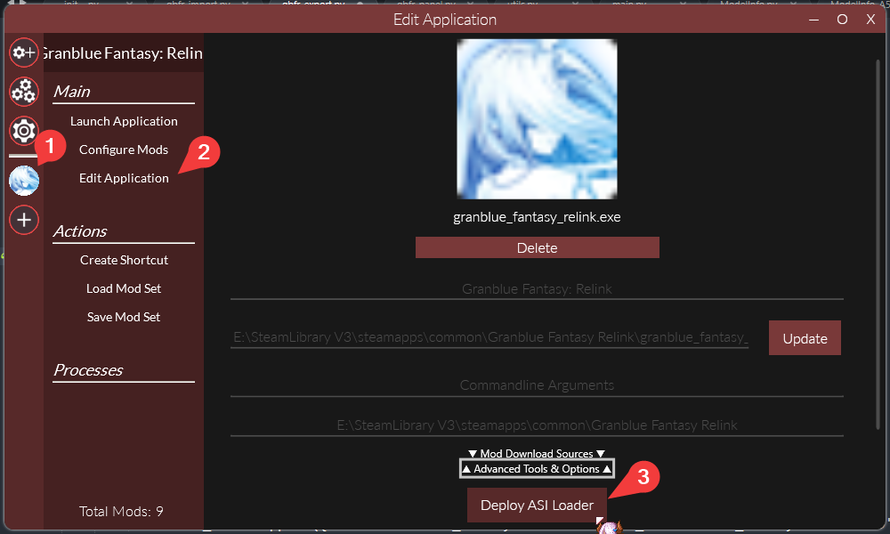

# Mod Manager

The Reloaded II mod manager combined with the Granblue Fantasy Relink Mod Manager mod is the primary way to manage mods for GBFR. It quickly handles what would normally be a multi-step process with GBFRDataTools for all managed mods.

---

## Requirements

* [Reloaded-II Mod Manager](https://github.com/Reloaded-Project/Reloaded-II/releases)
* [gbfrelink.utility.manager](https://github.com/WistfulHopes/gbfrelink.utility.manager/releases)

---

## Setting up Reloaded-II

1. Download Reloaded-II's `Release.zip`, or `Setup.exe`.
2. Extract `Release.zip` to its own folder or run the `Setup.exe` and install it.
3. Open `Reloaded-II.exe`.
4. Press the `+` Icon to add a game and select `Granblue Fantasy Relink.exe`.
5. In Reloaded-II's installation folder, open the folder called `Mods`.
6. Extract the `gbfrelink.utility.manager.zip` using the `Extract To...` option. It  should look like this:
    <figure markdown>
    
    *Make sure to extract `gbfrelink.utility.manager` into its own folder.*
    </figure>
7. In Reloaded-II make sure to tick on the checkbox next to `Granblue Fantasy Relink Mod Manager` to enable it.

!!! info "tip"

    For more information if needed, refer to the Reloaded II [Quick Start Guide](https://reloaded-project.github.io/Reloaded-II/QuickStart/).

---

## Installing Mods

1. Download a mod. You can find mods on sites like Nexus Mods and GameBanana.
2. Extract the `gbfrelink.utility.manager.zip` and any of your mod .zips into the `Mods` folder using the `Extract Here` option. **DO NOT USE EXTRACT `Extract to ...`**
    * Except for the gbfr.utility.manager, Mod folder structures in the `Mods` Folder should always look like `.../Mods/gbfrelink.mod.name/GBFR`:
    <figure markdown>
    
    </figure>
3. In Reloaded-II make sure to tick on the checkbox next to the mods to enable them.
4. Press `Launch Application` to launch the game and install the mods.
    * If you'd like to just launch the game with mods from steam, follow the instructions in the next section.

---

### Compatibility with SpecialK and GBFRelinkFix

Some programs/mods that directly inject into the game, like SpecialK or GBFRelinkFix, will be incompatible with Reloaded-II's default setup. Thankfully, this is easy to remedy.

<figure markdown>

</figure>

1. In Reloaded-II click on GBFR's icon.
2. Click `Edit Application`.
3. Open the `Advanced Tools & Options` dropdown.
4. Press `Deploy ASI Loader`.

You can now either launch the game through Reloaded-II or Steam.

---

### Video Tutorial - Mod Installation

<video controls>
    <source src="../GBFR Reloaded-II and Mod Installation Guide.mp4" type="video/mp4">
</video>


---

## Game Updates

!!! Warning
    ***Do this before Downloading the game update through steam!***

To properly update to a newer game version with mods installed:

* Rename `orig_data.i` in the game's folder to `data.i`. Otherwise Steam delta patching may attempt to patch a modded `data.i`, leading in an invalid file.
* Remove any tools/patch files you may have installed in the game's folder such as: 
    * `scripts` folder
    * `.asi` files 
    * `winmm.dll`

If that does not work, or you already downloaded the game update, delete the `data.i` file and verify game files integrity via Steam in the game's properties.

---

## Alternative Mod Managers

We cannot ensure that these will remain compatible with the Reloaded II Mod Manager.

* [Relink-Mod-Manager](https://github.com/Zetas-Workshop/Relink-Mod-Manager) 
    * [Wiki](https://github.com/Zetas-Workshop/Relink-Mod-Manager/wiki)
    * [Compatibility with Reloaded II Mods](https://github.com/Zetas-Workshop/Relink-Mod-Manager/wiki/Importing-Reloaded-II-Mod-Packs)

---

## Modding Manually

!!! warning

    It is important that you create a backup of `data.i` first. If you do not have one, you can verify game files integrity on Steam.


To add or update contents, simply add them to the `data` folder. **You should preserve the same paths.**

!!! example

    If you want to mod `system/table/ability.tbl`, drop it to the `data` folder as such:
    ```{ .sh .no-copy }
    .
    ├─ data/ # Always preserve game paths
    │  └─ system/
    │     └─ table/
    │        └─ ability.tbl
    │
    ...
    ```

Then run the following command:
``` markdown title="Command"
GBFRDataTools.exe add-external-files -i <path to data.i> 
```

!!! note

    If you are editing or adding files, you must re-run the command! You may also need to restore your original `data.i` if you've removed a file that was previously registed and wish to restore it.